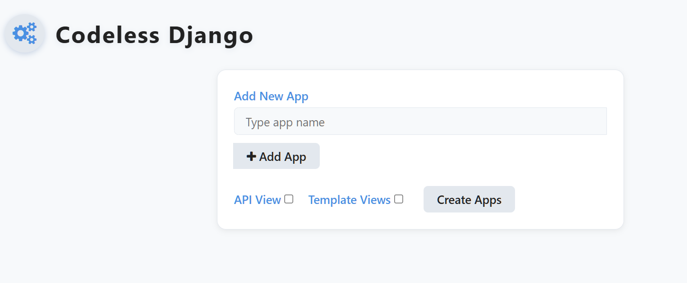

# CodeLess-Django

**CodeLess-Django** is a powerful Django tool that lets you build Django apps, models, fields, and APIs using a graphical interface—without writing repetitive boilerplate code. It's ideal for rapid prototyping, educational projects, and accelerating development.

---

## ✨ Features

* Create Django apps via UI
* Add models and fields dynamically
* Supports API Views and Template Views
* Auto-handles `INSTALLED_APPS`, serializers, views, and URLs
* Modern, responsive interface

---

## 📦 Installation

Install CodeLess-Django with pip:

```bash
pip install codeless-django
```

---

## ⚙️ Quick Start

1. **Add to your ****************************************`INSTALLED_APPS`****************************************:**

```python
# settings.py
INSTALLED_APPS = [
    ...
    'codeless_django',
]
```

2. **Include URLs in your project:**

```python
# urls.py
from django.urls import path, include

urlpatterns = [
    ...
    path('codeless-django/', include('codeless_django.urls')),
]
```

3. **Run the development server:**

```bash
python manage.py runserver
```

4. **Visit:** [http://127.0.0.1:8000/codeless-django/](http://127.0.0.1:8000/codeless-django/)

---

## 🖼️ Screenshots



### 🔹 App Creation Interface

* **Type your app name** in the input field.

---

### 🔸 Model and Field Builder
After creating the app:
* You’ll see your app in the right panel (e.g., `user`).
* Under "Add Model", type your model name and click **`Add Model`**.
* Click the model name (e.g., `User`) to expand it.
* Now:

  * Click **`Add Field`** to define model fields like `CharField`, `IntegerField`, etc.
  * Set the field name and options (e.g., `max_length`, `default`, `null`).
* Optionally, click **`Add Meta`** to add class-level options like `ordering` or `verbose_name`.

Repeat this process for as many models and fields as you need.

---

## ✅ Final Step: Create Apps

After adding all your models and fields:

* Hit the **`Create Apps`** button to generate files.
* Select:

  * ✅ `API View` – if you want REST API views generated.
  * ✅ `Template Views` – if you want generic HTML views generated.
* Your Django app will now include:

  * `models.py`
  * `serializers.py` (if API View checked)
  * `views.py`
  * `urls.py`
  * `admin.py`
*

---

## 🤝 Contribution

We welcome contributions! Feel free to open issues, suggest improvements, or submit PRs.

---

## 🛠️ License

MIT License
